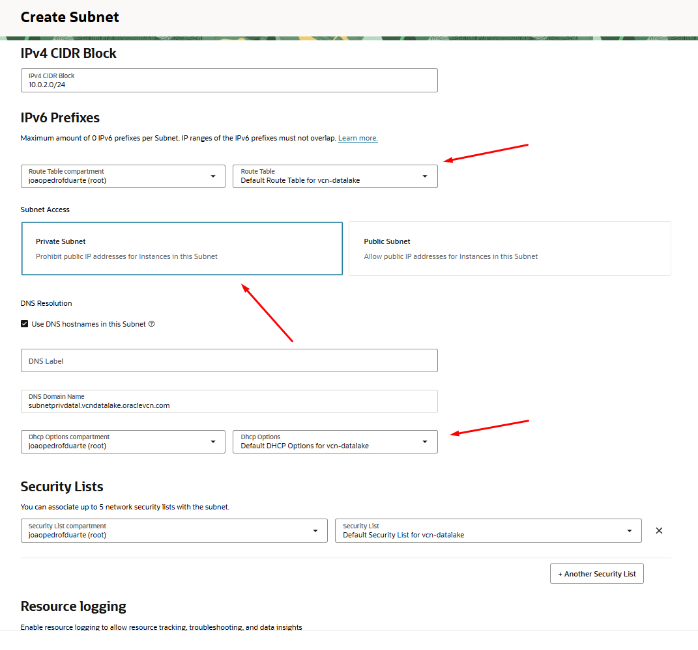
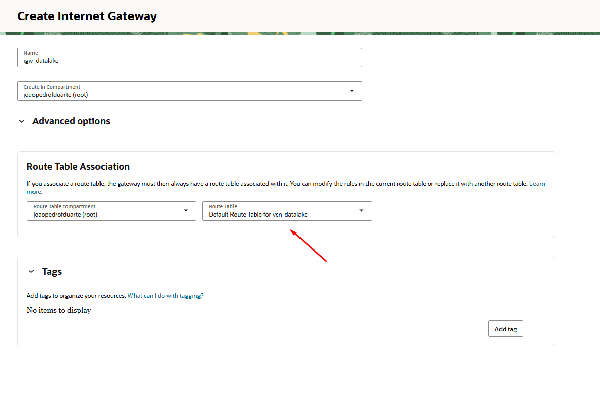
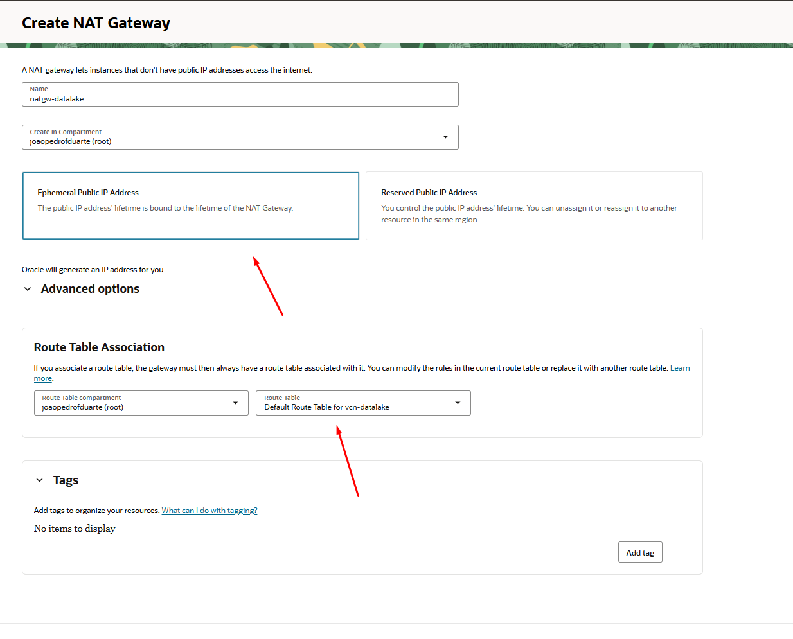

# 01 • Controle de Acesso

## 1. Criação do Compartimento
Como sua conta foi criada recentemente, já existe também um compartimento associado, um espaço, em que você consegue acessar todos os componentes associados. Quando realizou login, o nome usado para dizer o espaço ao qual queria entrar, era o nome do compartimento.

> Definição: É definido como uma partição lógica dentro da tenancy, utilizada para organizar, isolar e controlar o acesso a recursos de nuvem, como instâncias, redes, volumes e buckets.

Acesse o [Link](https://cloud.oracle.com/identity/compartments) e verá seu compartimento já criado. Nessa documentação, iremos manter como está, visto que focaremos na criação de apenas uma estrutura e não é necessário um controle de acesso mais robusto para tal.

## 2. Criação da Virtual Cloud Network (VCN)

Uma VCN é uma rede definida por software, criada nos data centers da Oracle Cloud Infrastructure, que fornece um ambiente de rede privado, seguro e configurável para hospedar e conectar recursos de nuvem, como máquinas virtuais, bancos de dados, balanceadores de carga e outros serviços.

Inicialmente, no painel da OCI, acesse **Rede** > **Redes virtuais em nuvem (VCN)** > **Criar VCN**.

---

---

Após isso clique em criar VCN.

---

---

Enfim, no painel de configuração da VCN, deixe conforme neste exemplo.

---

---

### Passo a passo

1. Informe um nome descritivo, por exemplo: `vcn-datalake`.
2. Em **Bloco CIDR IPv4**, insira:
10.0.0.0/16

Este bloco suporta até 65.534 endereços IP privados, suficiente para clusters de pequeno a grande porte.

3. Deixe as demais opções padrão, exceto:
4. **Marque** a opção **"Use DNS hostnames in this VCN"**.
- Isso permitirá que todas as instâncias criadas nesta VCN recebam nomes de host DNS internos.
5. Clique em **Criar VCN** para finalizar.

## 3. Criação da sub-rede pública
Se já não estiver no painel da VCN:

1. No painel da Oracle Cloud Infrastructure (OCI), acesse:
   - **Menu** > **Rede** > **Redes virtuais em nuvem (VCN)**
2. Clique sobre a VCN criada anteriormente (`vcn-datalake`).
3. No menu lateral da VCN, selecione **Sub-redes**.
4. Clique em **Criar Sub-rede**.

### Parâmetros recomendados

- **Nome da sub-rede:** `subnet-pub-datalake`
- **Tipo de sub-rede:** Pública
- **Bloco CIDR IPv4:** `10.0.1.0/24`
- **DNS Label:** `pubdatalake`
- **Gateway de Internet:** Selecione o gateway de internet criado para a VCN (`igw-datalake`)
- **Tabela de rotas:** Selecione a tabela de rotas padrão ou a associada ao gateway de internet
- **Lista de segurança:** Selecione a lista de segurança default do compartimento

> O bloco CIDR `10.0.1.0/24` permite até 254 endereços IP privados, suficiente para a maioria dos clusters de ensino e laboratório.

---

---

## 4. Criação da sub-rede privada
A sub-rede privada é utilizada para hospedar instâncias que não precisam de acesso direto à internet, como nós de processamento de dados ou serviços internos do cluster. O tráfego externo dessas instâncias pode ser realizado por meio de um NAT Gateway.

Se já não estiver no painel da VCN:

1. No painel da Oracle Cloud Infrastructure (OCI), acesse:
   - **Menu** > **Rede** > **Redes virtuais em nuvem (VCN)**
2. Clique sobre a VCN criada anteriormente (`vcn-datalake`).
3. No menu lateral da VCN, selecione **Sub-redes**.
4. Clique em **Criar Sub-rede**.

### Parâmetros recomendados

- **Nome da sub-rede:** `subnet-priv-datalake`
- **Tipo de sub-rede:** Privada
- **Bloco CIDR IPv4:** `10.0.2.0/24`
- **DNS Label:** `privdatalake`
- **Gateway NAT:** Selecione o NAT Gateway criado para a VCN (`natgw-datalake`)
- **Tabela de rotas:** Selecione a tabela de rotas associada ao NAT Gateway
- **Lista de segurança:** Selecione a lista de segurança default do compartimento

> O bloco CIDR `10.0.2.0/24` permite até 254 endereços IP privados, suficiente para hospedar múltiplos nós internos do cluster, mantendo-os isolados de acessos externos diretos.

---

---

## 5. Criação dos Gateways de Internet e NAT

Os gateways de Internet e NAT são componentes essenciais para permitir que as instâncias da VCN tenham comunicação externa, seja de forma pública (Internet Gateway) ou privada (NAT Gateway). O Internet Gateway permite acesso direto à internet para sub-redes públicas, enquanto o NAT Gateway permite que instâncias em sub-redes privadas acessem a internet para atualizações e downloads, sem expor seus IPs diretamente.

Se já não estiver no painel da VCN:

1. No painel da Oracle Cloud Infrastructure (OCI), acesse:
   - **Menu** > **Rede** > **Redes virtuais em nuvem (VCN)**
2. Clique sobre a VCN criada anteriormente (`vcn-datalake`).

---

### 5.1 Criação do Internet Gateway

3. No menu lateral da VCN, selecione **Gateways de Internet**.
4. Clique em **Criar Gateway de Internet**.

#### Parâmetros recomendados

- **Nome do Internet Gateway:** `igw-datalake`
- **Compartment:** Selecione o compartimento do projeto
- **Route Table Association:** Selecione a tabela de rotas padrão da VCN (`Default Route Table for vcn-datalake`)

> O Internet Gateway permite que as instâncias em sub-redes públicas comuniquem-se com a internet, sendo essencial para acesso SSH, atualizações e serviços web.

---

### 5.2 Criação do NAT Gateway

5. No menu lateral da VCN, selecione **NAT Gateways**.
6. Clique em **Criar NAT Gateway**.

#### Parâmetros recomendados

- **Nome do NAT Gateway:** `natgw-datalake`
- **Compartment:** Selecione o compartimento do projeto
- **Ephemeral Public IP Address:** Deixe selecionada a opção padrão (IP público efêmero)
- **Route Table Association:** Selecione a tabela de rotas padrão da VCN (`Default Route Table for vcn-datalake`)

> O NAT Gateway permite que instâncias em sub-redes privadas acessem a internet para atualizações e downloads, sem expor seus IPs privados diretamente à internet.

---

> Após criar ambos os gateways, vamos ajustar as tabelas de rotas de cada sub-rede, para que o tráfego de saída da sub-rede pública utilize o Internet Gateway e o tráfego da sub-rede privada utilize o NAT Gateway.

---

