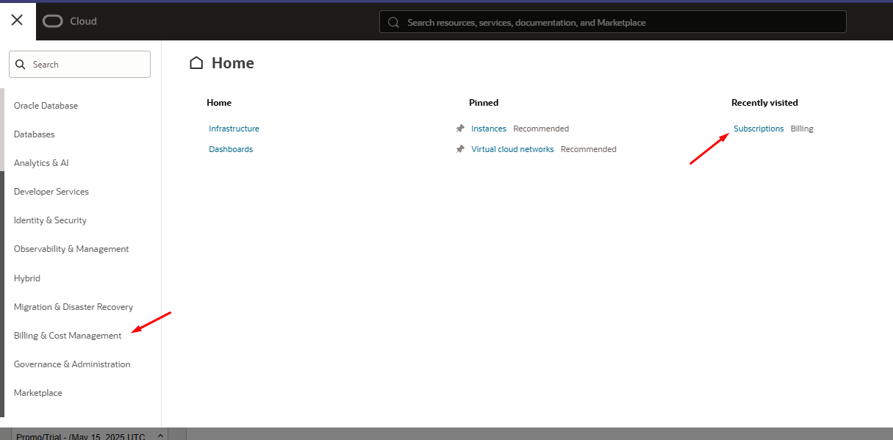
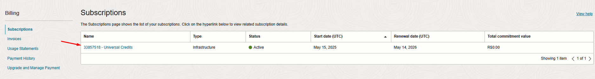
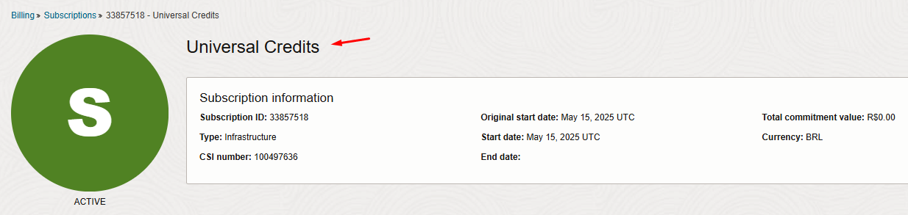
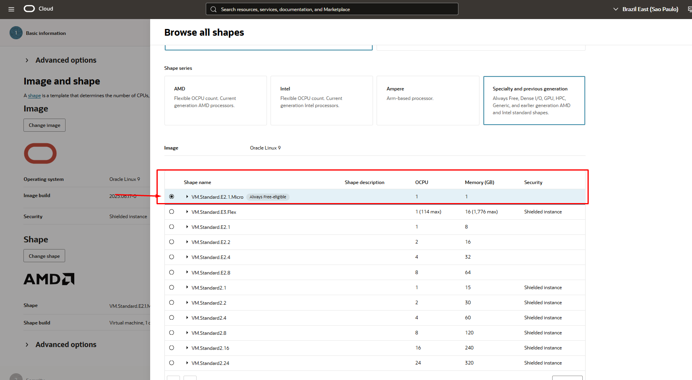

# 03.1 • Provisionamento das Máquinas Virtuais Free Tier

Este espaço é dedicado para os processos de criação de máquinas virtuais com máquinas free tier na OCI. Neste caso, é apenas um procedimento útil de ser abordado antes da criação das máquinas em si, portanto, caso opte por criar o cluster inteiramente em máquinas free tier ou pelo menos com certa quantidade de máquinas free tier, recomendo que realize os processos daqui antes.

## Upgrade de conta
É importante que você coloque seu cartão de crédito na OCI, como também verifique se o seu plano está como o de acordo ao debaixo:

---

---

---

---

Caso já esteja, pode manter dessa forma, assim aumenta as chances de consegui realizar a criação com máquinas free tier.

## Diferenças quanto ao processo anterior
O que torna este processo distinto do anterior, é apenas um detalhe, no caso, a máquina a ser selecionada, deve ter uma marcação como "always free eligible", conforme a imagem abaixo.

---

---

Outro ponto interessante seja talvez consultar a bibliografia abaixo para mais informações quanto à planos da OCI e suas formas de cobrança.

[Oracle Cloud - Preços](https://www.oracle.com/br/cloud/pricing/)
