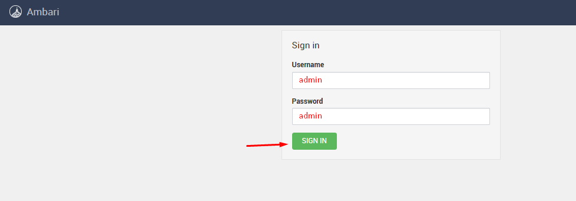
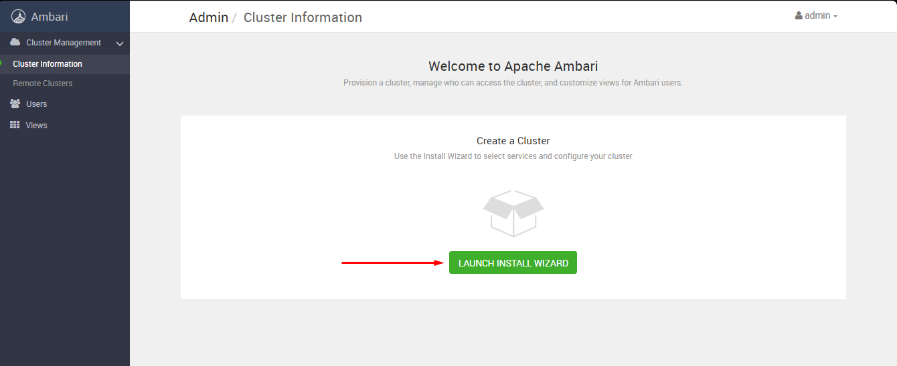
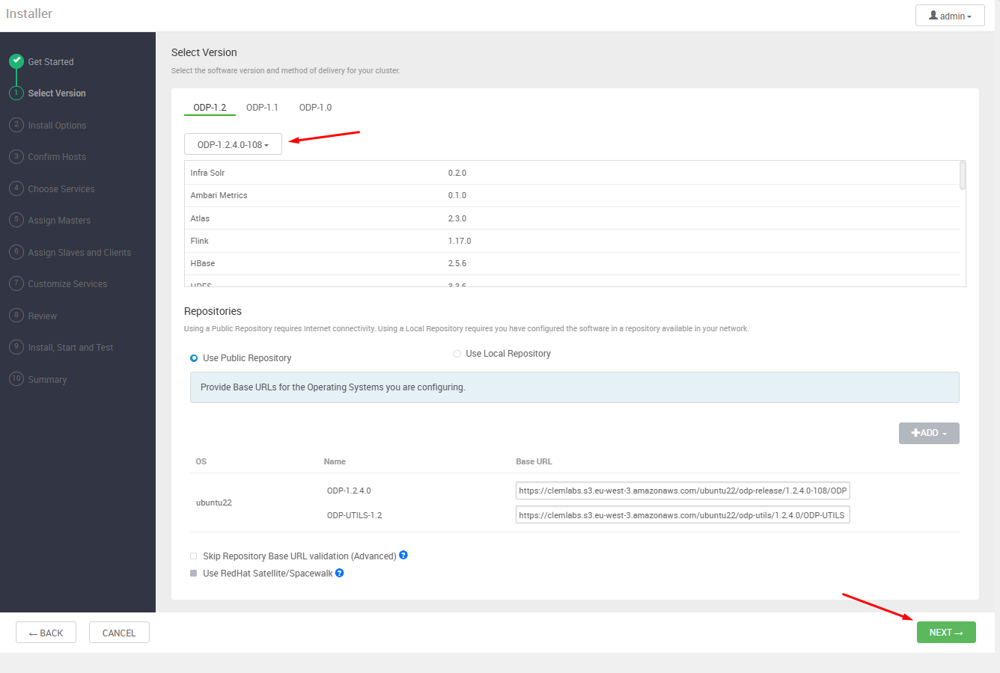
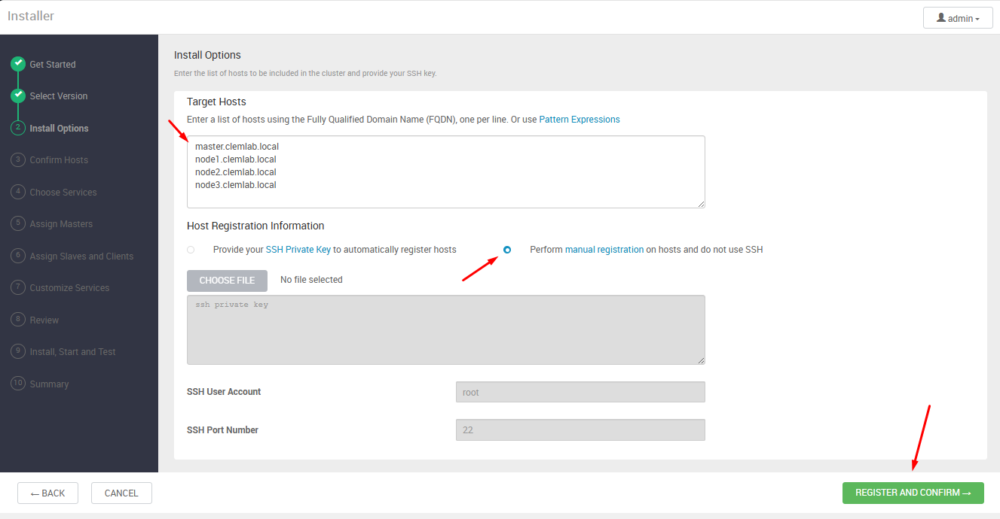
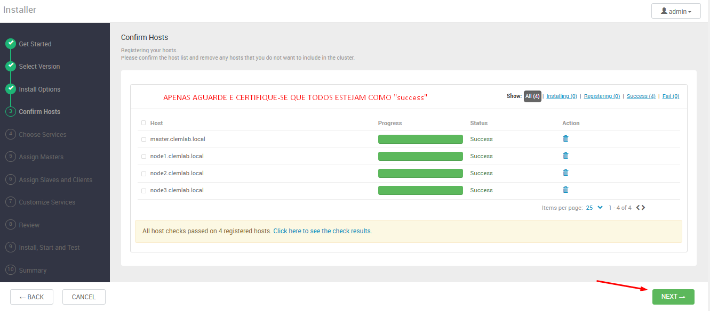
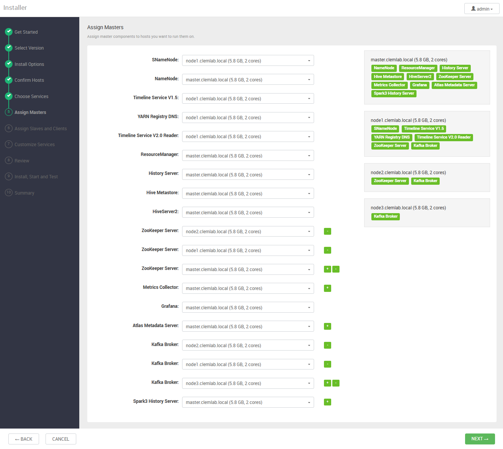
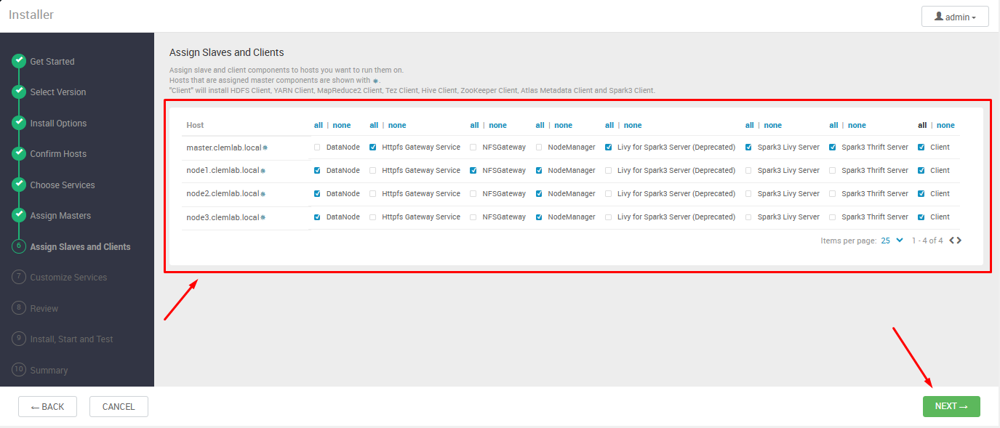
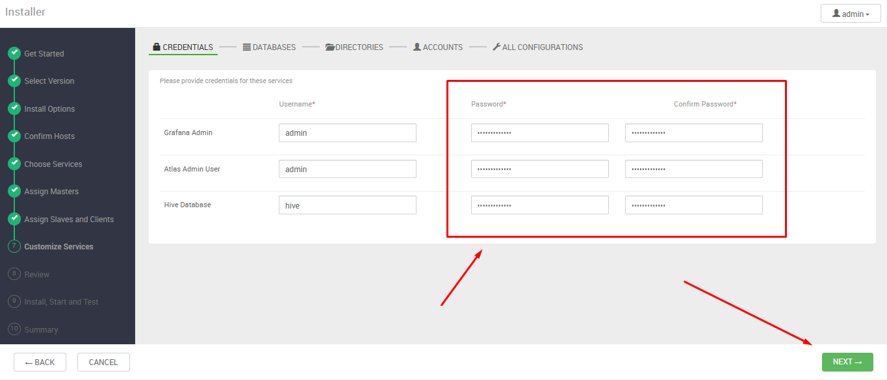

# 03 – Configuração do Ambari pela interface

Conforme o que foi desenvolvido no passo anterior, agora digite em seu navegador o endereço IPv4 da sua máquinas *master* na porta 8080. Um socket como este: **<ip_master>:8080**. Dessa forma verá como disponível a tela abaixo:

---

---

Tendo realizado o login agora iniciam-se as etapas de configuração referentes ao desenvolvimento do cluster conforme suas necessidades de uso. A seguinte tela estará disponível para que você acesse:

---

---

## Inicío do processo de configuração do Cluster
Aqui apenas escolhemos um nome para Cluster que estamos montando, neste sentido, por questões de padrão, manterei como **CDP**.

---

---

## Adicionando a Stack ODP customizada via VDF no Ambari

Após nomear o cluster na interface do Ambari, o próximo passo é selecionar a distribuição da stack que será utilizada. Como o ODP não aparece na listagem pública por padrão, será necessário **adicionar manualmente o arquivo VDF (Version Definition File)** referente ao stack ODP fornecido pela Clemlab.

### Passo a passo para adicionar o VDF customizado

1. **Na tela "Select Version" (Selecionar Versão):**
   - Clique em **"Add Version"** (Adicionar Versão) ou **"Adicionar versão personalizada"**, conforme a interface.

2. **No campo "Version name" (Nome da Versão):**
   - Defina um nome amigável para identificar a stack. Exemplo: `ODP 1.2.4.0`.

3. **No campo "Version Definition File (VDF) URL":**
   - Cole o endereço abaixo:
     ```
     https://archive.clemlab.com/ubuntu22/odp-release/1.2.4.0-108/ODP-VDF.xml
     ```

4. **Clique em "Next" (Avançar) ou "OK", conforme disponível.**
   - O Ambari fará o download e validação do arquivo VDF.
   - Aguarde até que a stack ODP apareça listada entre as versões disponíveis.

5. **Selecione a stack recém-adicionada ("ODP 1.2.4.0").**

6. **Prossiga com o assistente de configuração normalmente.**
   - Siga para as próximas telas onde será definida a origem dos repositórios, serviços e mapeamento dos nós.

Deve ficar como na imagem abaixo:

---

---

## Registro Manual de Hosts na Interface do Ambari
Apenas para fins de verificação, execute os comandos abaixo em sua máquina master e verifique se retorna "OK" **para todos**.

```bash
ssh ubuntu@master.clemlab.local "hostname -f && echo OK"
ssh ubuntu@node1.clemlab.local "hostname -f && echo OK"
ssh ubuntu@node2.clemlab.local "hostname -f && echo OK"
ssh ubuntu@node3.clemlab.local "hostname -f && echo OK"
```

Após validar o acesso SSH sem senha entre o nó master e todos os demais nós do cluster usando seus nomes FQDN, siga para os passos abaixo:

### Tela "Install Options" – Opções de Instalação

Na etapa "Install Options" do instalador do Ambari:

1. **Target Hosts**
   - Insira uma lista dos nomes FQDN de todos os nós do cluster, um por linha (conforme definido previamente).
     Exemplo:
     ```
     master.clemlab.local
     node1.clemlab.local
     node2.clemlab.local
     node3.clemlab.local
     ```
2. **Host Registration Information**
   - Selecione a opção **"Perform manual registration on hosts and do not use SSH"** (Registrar manualmente os hosts e não usar SSH automático).
   - **Não é necessário** informar chave privada SSH, usuário ou porta, pois o acesso já foi previamente configurado manualmente.
3. Clique em **REGISTER AND CONFIRM** para prosseguir.

Deve ficar conforme a imagem abaixo:

---

---

## Confirmação dos Hosts Registrados no Ambari

Após inserir os FQDNs dos nós do cluster e optar pelo registro manual, o Ambari realiza a verificação do status de cada host na etapa "Confirm Hosts".

### O que esperar nesta etapa

- O Ambari irá checar automaticamente a conectividade com os agentes instalados em cada nó.
- Se tudo foi configurado corretamente (`ambari-agent` em execução, hostnames definidos e acesso de rede funcional), todos os nós aparecerão listados com o status **"Success"**, conforme mostra a tela abaixo:

---

---

Na imagem, todos os nós (`master.clemlab.local`, `node1.clemlab.local`, `node2.clemlab.local`, `node3.clemlab.local`) foram registrados com sucesso e os "host checks" passaram sem falhas.

Quando todos os hosts apresentarem o status **Success**, a infraestrutura básica do cluster está pronta para a definição dos serviços e papéis de cada nó.

## Escolha dos Componentes do Cluster

Após a confirmação dos hosts do cluster, a próxima etapa consiste na **seleção dos componentes** que serão instalados e configurados em cada nó, conforme as necessidades do seu ambiente. Essa decisão é fundamental, pois influencia diretamente nos recursos disponíveis para processamento, ingestão, análise e governança de dados.

### Componentes selecionados para este ambiente

Para o projeto atual, serão instalados os seguintes componentes centrais:

- **YARN + MapReduce2**: Gerenciamento de recursos e processamento distribuído de dados.
- **Hive**: Data warehouse para consultas SQL sobre grandes volumes de dados em HDFS.
- **Ambari Metrics**: Coleta, armazenamento e visualização de métricas do cluster.
- **Atlas**: Catalogação, governança e rastreamento de linhagem dos dados.
- **Kafka**: Plataforma de streaming para ingestão e processamento de eventos em tempo real.
- **Spark3**: Engine de processamento distribuído em memória para análises avançadas.
- **Infra Solr**: Serviço de indexação e busca baseado no Apache Solr, utilizado internamente pelo cluster para suportar funcionalidades como busca rápida de logs, auditorias e metadados em serviços como Atlas e Ranger. 
- **ZooKeeper**: Serviço centralizado para coordenação e gerenciamento de configuração, sincronização, eleição de líderes e registro de nomes entre serviços distribuídos.
- **Tez**: Framework avançado de execução para processamento de dados no Hadoop. Permite criar e processar grafos direcionados acíclicos (DAGs) de tarefas de dados, otimizando e acelerando queries complexas em frameworks como Hive e Pig.


Esses componentes formam o núcleo de um Data Lake moderno, suportando cargas batch, streaming, consultas interativas e governança.

---

### Referência de componentes

Para entender o papel de cada componente, suas funcionalidades e os cenários indicados para uso, acesse o arquivo complementar abaixo, onde está disponível uma tabela detalhada de todos os serviços suportados pela distribuição ODP:

- [`docs/02-ODP/03.1-configuracao-servicos-componentes.md`](./03.1-configuracao-servicos-componentes.md)

Neste documento complementar, você encontrará:

- Nome de cada componente
- Descrição resumida da função
- Situações principais para aplicação
- Dependências e recomendações de uso em diferentes perfis de cluster

## Distribuição dos Papéis de Master – Assign Masters

Durante o assistente de configuração do Ambari, após a seleção dos componentes, você será direcionado à tela **Assign Masters**, responsável por atribuir os papéis de "master" de cada serviço do cluster aos diferentes nós.

### O que deve ser feito nesta etapa

- Atribua cada função de master seguindo o modelo apresentado na interface, replicando a seleção da imagem de referência.
- Esta distribuição garante o balanceamento das cargas e a alta disponibilidade dos principais serviços.

---

### Distribuição recomendada dos Masters

| Função                          | Nó designado                   |
|---------------------------------|-------------------------------|
| NameNode                        | node1.clemlab.local           |
| Secondary NameNode              | master.clemlab.local          |
| Timeline Service V1.5           | node1.clemlab.local           |
| YARN Registry DNS               | node1.clemlab.local           |
| Timeline Service V2.0 Reader    | master.clemlab.local          |
| ResourceManager                 | master.clemlab.local          |
| History Server                  | master.clemlab.local          |
| Hive Metastore                  | master.clemlab.local          |
| HiveServer2                     | master.clemlab.local          |
| ZooKeeper Server (1)            | node2.clemlab.local           |
| ZooKeeper Server (2)            | node1.clemlab.local           |
| ZooKeeper Server (3)            | master.clemlab.local          |
| Metrics Collector               | master.clemlab.local          |
| Grafana                         | master.clemlab.local          |
| Atlas Metadata Server           | master.clemlab.local          |
| Kafka Broker (1)                | node2.clemlab.local           |
| Kafka Broker (2)                | node1.clemlab.local           |
| Kafka Broker (3)                | node3.clemlab.local           |
| Spark3 History Server           | master.clemlab.local          |

> **Atenção:**
> Não altere esta configuração recomendada — ela foi desenhada para garantir distribuição de carga, robustez na operação e boa prática em ambientes de clusters Hadoop/Spark.

Deve ficar exatamente conforme esse imagem:

---

---

### Como selecionar

1. **Para cada serviço listado**, utilize o menu suspenso da coluna correspondente na interface para escolher o mesmo nó que aparece como selecionado na imagem.
2. **Não pule nenhum serviço.** Confirme que todos estão atribuídos aos mesmos nós indicados.
3. Após finalizar todas as seleções, avance para a próxima etapa do assistente.

## Etapa: Atribuição de Slaves e Clientes – Assign Slaves and Clients

Na sequência do assistente de configuração do Ambari, após definir os masters, chega-se à etapa **Assign Slaves and Clients**. Aqui você irá especificar quais nós do cluster irão executar os papéis de slave (DataNode, NodeManager, etc.) e quais receberão componentes cliente.

### O que fazer nesta etapa

Realize a marcação exatamente como apresentado na tela de referência do assistente (todas as opções “DataNode”, “NodeManager”, “Spark3 Livy Server”, “Spark3 Thrift Server”, “Client” selecionadas para todos os nodes, exceto os gateways apenas quando necessário).

---

---
## Customização de Serviços

### Passo 1 – Preenchimento dos Dados de Credentials

Nesta primeira etapa ("Credentials") da configuração no assistente do Ambari/ODP, será solicitado que você insira o nome de usuário e as senhas para os serviços essenciais do cluster, como Grafana Admin, Atlas Admin e Hive Database.

- **O que fazer:**
  - Defina senhas para cada serviço nas caixas indicadas.
  - Você pode padronizar as senhas, utilizando uma mesma senha forte para todos os campos, facilitando a administração inicial do ambiente.
  - Lembre-se de anotar as credenciais em local seguro para uso futuro nas interfaces administrativas dos serviços.
  - Confirme cada senha digitando novamente no campo de confirmação correspondente.

---

---

Após preencher todos os campos, clique em **Next** para avançar à próxima etapa da configuração.


